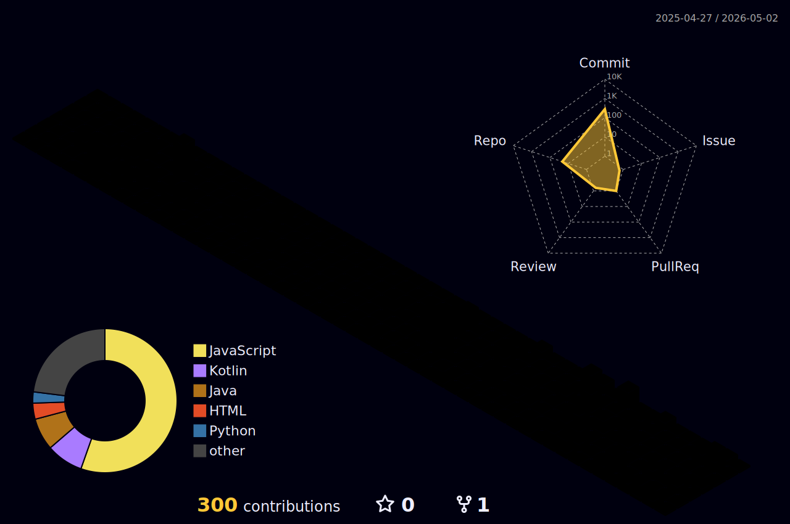

  
  

  

  

    
  

  I am a final-year <b>Informatics Student at UPN Veteran Jakarta</b> and a passionate  
  <b>2024 Bangkit Academy Graduate</b> specializing in <b>Mobile Development (Android)</b>.   
  I love building impactful apps and exploring new technologies like <b>Flutter & Unity</b>.

 

---

### 🧐 About Me & What I'm Up To

- 🔭 I’m currently working on my Thesis: **Sleep Quality Classification using Random Forest**.
- 🌱 I’m currently exploring **Flutter & Unity** for cross-platform development.
- 👯 I’m looking to collaborate on **Open Source Android Apps**.

---

### 💻 My Tech Stack

	
  
  
  
  
  
  
    

  
  
  
  
  
  
  
  
  
  
  

    

  
  
  
  
  
  
  
  
  

---

### 🚀 Featured Projects

| Project Name | Description | Tech Stack |
| :--- | :--- | :--- |
| [**PlanetKu (Bangkit Capstone)**](https://github.com/Rafie1715/PlanetKuApp) | A smart waste management Android app featuring AI-powered classification, a carbon emission calculator, and price prediction. | `Kotlin` `Firebase` `GCP` `ML` |
| [**CinemaZone (Booking App)**](https://github.com/Rafie1715/CinemaZone) | A Kotlin-based movie ticket booking app with Firebase Auth & Firestore, interactive seat-picker, and Retrofit API integration. | `Kotlin` `Firebase` `Retrofit` |
| [**Computer Crafter**](https://github.com/inotlusrabka/Computer-Crafter) | A PC assembly simulation website that allows users to virtually build their dream computer. | `JS` `PHP` `MySQL` `Bootstrap` |

➡️ *Check out more projects in my [Repositories](https://github.com/Rafie1715?tab=repositories) tab!*

---

### 📊 GitHub Activity

  

  

  

---

### 📫 Connect with Me

  
  
  

