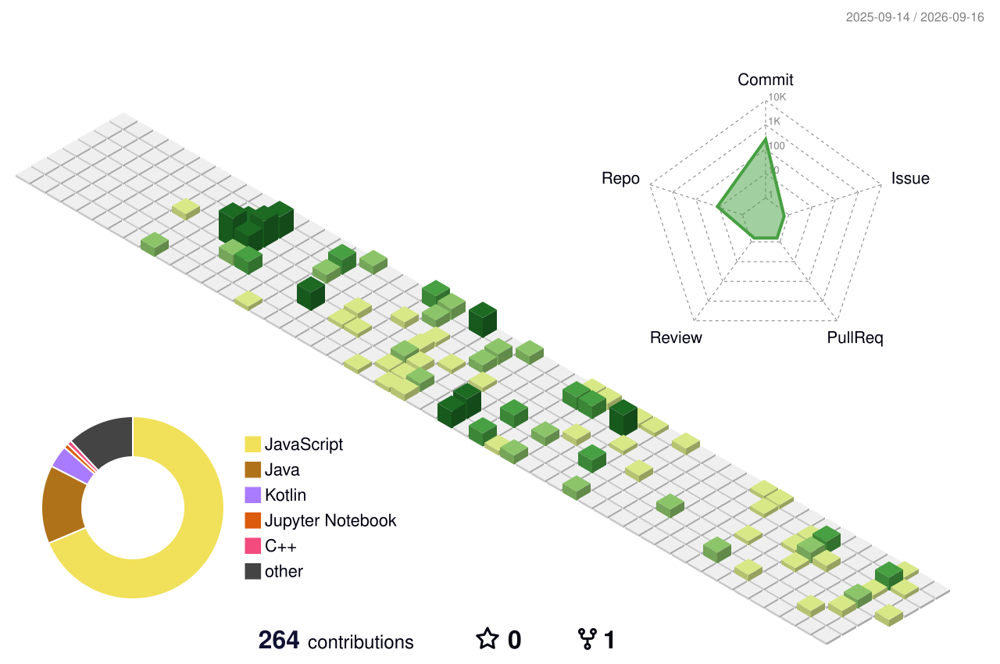

  

---

### 👨‍💻 About Me
I am a highly motivated **Fresh Graduate in Informatics** from Universitas Pembangunan Nasional Veteran Jakarta (GPA: 3.89/4.00) and an alumnus of the **Bangkit Academy 2024** in the Mobile Development (Android) path. I have a strong passion for building seamless applications and a deep interest in integrating AI solutions into software.

*   🎓 **Education:** Informatics Engineering, UPN Veteran Jakarta.
*   🚀 **Focus Area:** Android Development (Kotlin/Java), Web Development (ReactJS/Vite).
*   🤖 **Current Interest:** Exploring Artificial Intelligence and Machine Learning, specifically implementing Random Forest algorithms for data classification.
*   📫 **Reach me at:** [[LinkedIn]](https://linkedin.com/in/rafie-rojagat/) | [[Email]](mailto:rojagatrafie@gmail.com)

---

### 🛠️ Tech Stack & Tools

  

---

### 🚀 Featured Projects
*   **[RestUP](#)** - Currently developing an Android application focused on Sleep Quality Classification using Machine Learning (Random Forest).
*   **[PlanetKu](#)** - Developed a smart waste management Android app featuring AI classification and a carbon emission calculator (Bangkit Academy Capstone).
*   **[CinemaZone](#)** - A robust movie ticket booking application built using Kotlin, Firebase, and Retrofit.
*   **[Computer Crafter](#)** - A web-based PC assembly simulation platform crafted with JavaScript, PHP, and MySQL.

---

### 📊 GitHub Stats & Contributions

  

 

  <h3>🐍 Contribution Snake</h3>
  

  <h3>🧊 3D Contribution Calendar</h3>
  

